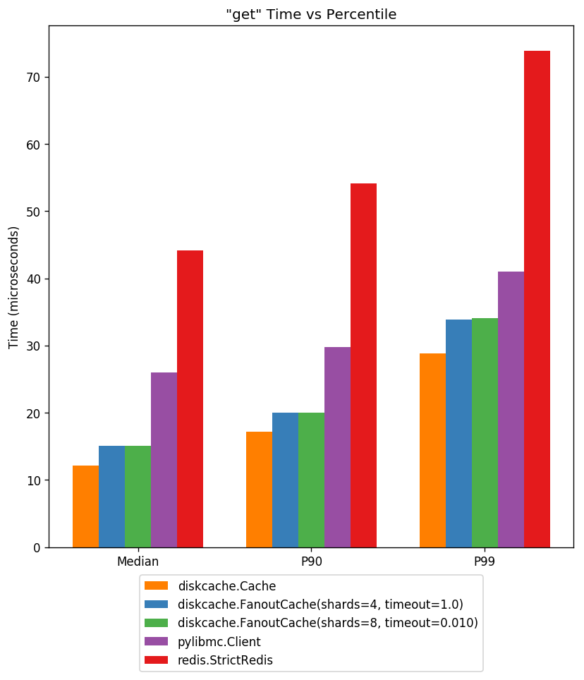
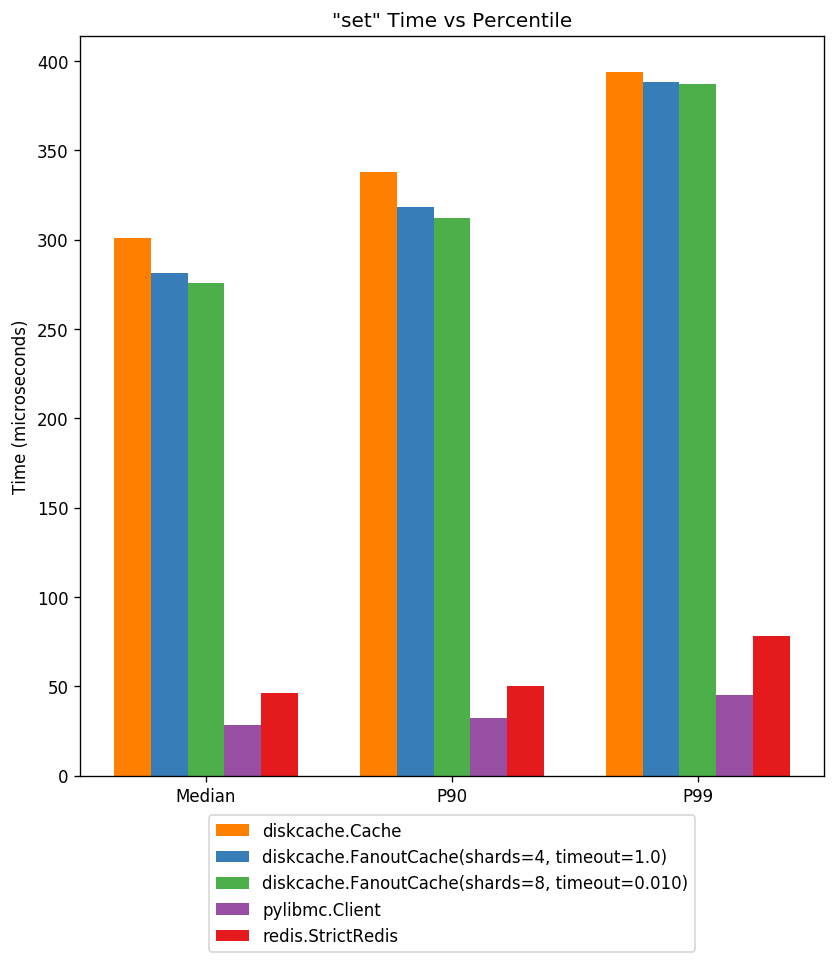
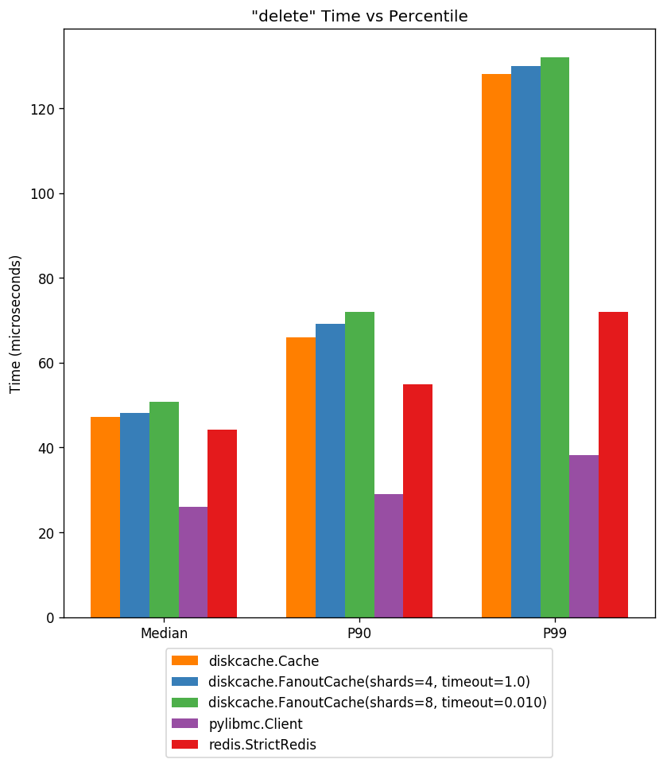
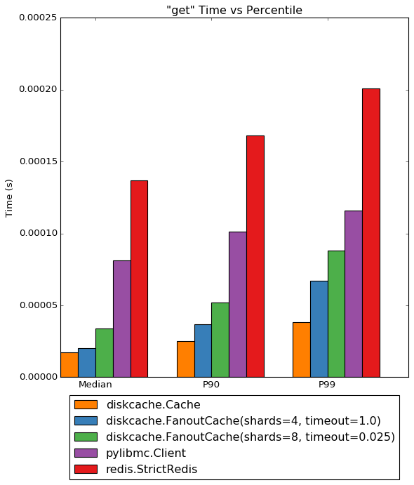
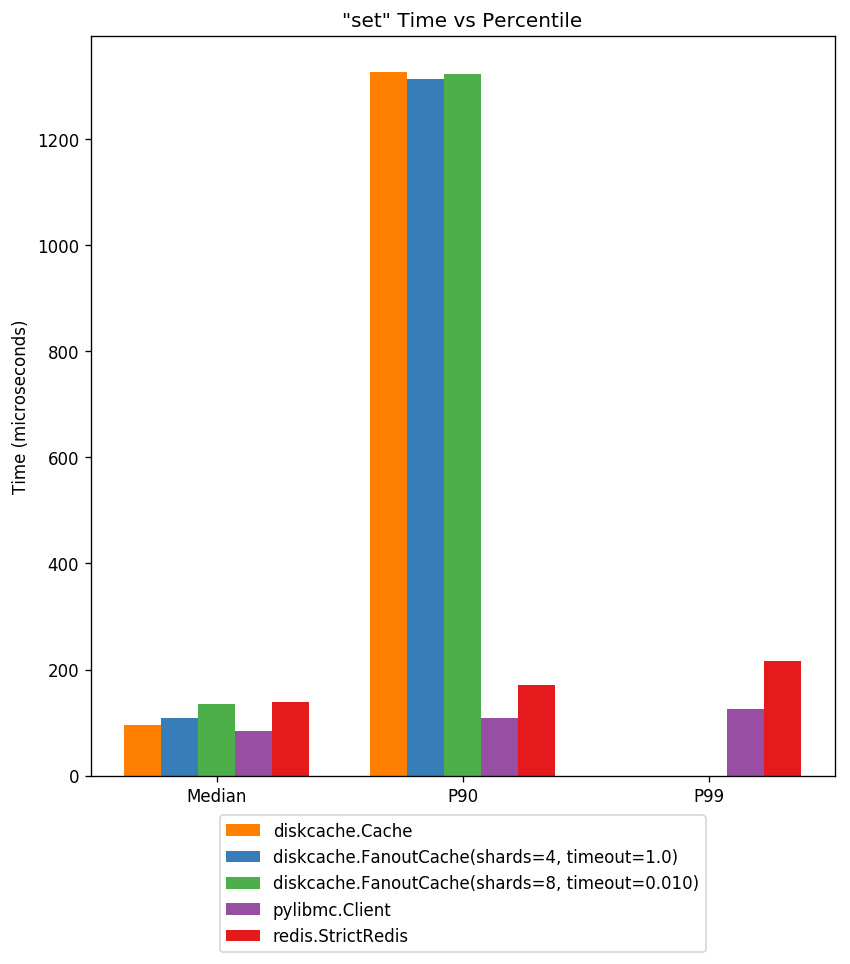
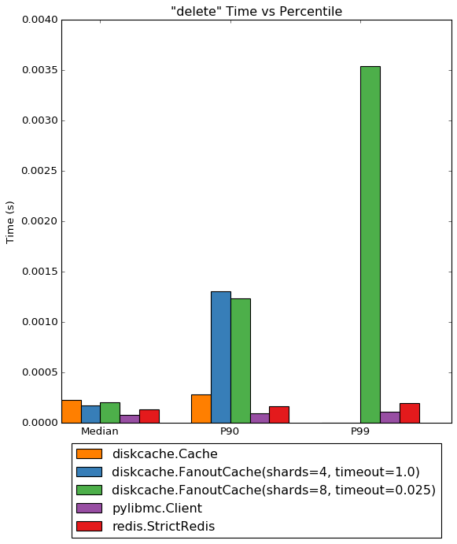

DiskCache Cache Benchmarks
==========================

Accurately measuring performance is a difficult task. The benchmarks on this
page are synthetic in the sense that they were designed to stress getting,
setting, and deleting items repeatedly. Measurements in production system are
much harder to reproduce reliably. So take the following data with a grain of
salt. A stated feature of :doc:`DiskCache <index>` is performance so we would
be remiss not to produce this page with comparisons.

The source for all benchmarks can be found under the "tests" directory in the
source code repository. Measurements are reported by percentile: median, 90th
percentile, 99th percentile, and maximum along with total time and miss
rate. The average is not reported as its less useful in response-time type
scenarios. Each process in the benchmark executes 100,000 operations with ten
times as many sets as deletes and ten times as many gets as sets.

Each comparison includes `Memcached`_ and `Redis`_ with default client and
server settings. Note that these systems work differently as they communicate
over the localhost network. The also require a server process running and
maintained. All keys and values are short byte strings to reduce the network
impact.

.. _`Memcached`: http://memcached.org/
.. _`Redis`: http://redis.io/

Single Access
-------------

The single access workload starts one worker processes which performs all
operations. No concurrent cache access occurs.

Get
...

Above displays cache access latency at three percentiles. Notice the
performance of :doc:`DiskCache <index>` is faster than highly optimized
memory backed server solutions.

Set
...

Above displays cache store latency at three percentiles. The cost of writing to
disk is higher but still sub-millisecond. All data in :doc:`DiskCache <index>`
is persistent.

Delete
......

Above displays cache delete latency at three percentiles. As above, deletes
require disk writes but latency is still sub-millisecond.

Timing Data
...........

Not all data is easily displayed in the graphs above. Miss rate, maximum
latency and total latency is recorded below.

========= ========= ========= ========= ========= ========= ========= =========
Timings for diskcache.Cache
-------------------------------------------------------------------------------
   Action     Count      Miss    Median       P90       P99       Max     Total
========= ========= ========= ========= ========= ========= ========= =========
      get     88966      9705  20.981us  25.988us  35.048us 438.929us   1.857s
      set      9021         0 323.057us 480.175us 580.072us   1.174ms   3.032s
   delete      1012       104 248.909us 283.003us 416.994us 720.978us 232.533ms
    Total     98999                                                     5.122s
========= ========= ========= ========= ========= ========= ========= =========

The generated workload includes a ~1% cache miss rate. All items were stored
with no expiry. The miss rate is due entirely to gets after deletes.

========= ========= ========= ========= ========= ========= ========= =========
Timings for diskcache.FanoutCache(shards=4, timeout=1.0)
-------------------------------------------------------------------------------
   Action     Count      Miss    Median       P90       P99       Max     Total
========= ========= ========= ========= ========= ========= ========= =========
      get     88966      9705  15.974us  23.842us  33.855us 165.224us   1.523s
      set      9021         0 287.056us 433.922us 520.945us   7.173ms   2.698s
   delete      1012       104 222.206us 261.068us 360.012us 592.947us 210.354ms
    Total     98999                                                     4.432s
========= ========= ========= ========= ========= ========= ========= =========

The high maximum store latency is likely an artifact of disk/OS interactions.

========= ========= ========= ========= ========= ========= ========= =========
Timings for diskcache.FanoutCache(shards=8, timeout=0.025)
-------------------------------------------------------------------------------
   Action     Count      Miss    Median       P90       P99       Max     Total
========= ========= ========= ========= ========= ========= ========= =========
      get     88966      9705  15.974us  23.127us  33.140us 786.066us   1.514s
      set      9021         0 287.056us 429.869us 523.090us   2.006ms   2.685s
   delete      1012       104 226.974us 261.068us 333.071us 540.018us 211.712ms
    Total     98999                                                     4.411s
========= ========= ========= ========= ========= ========= ========= =========

Notice the low overhead of the :class:`FanoutCache
<diskcache.FanoutCache>`. Even without concurrent access, a slight benefit is
observable.

========= ========= ========= ========= ========= ========= ========= =========
Timings for pylibmc.Client
-------------------------------------------------------------------------------
   Action     Count      Miss    Median       P90       P99       Max     Total
========= ========= ========= ========= ========= ========= ========= =========
      get     88966      9705  26.941us  30.041us  40.054us 140.905us   2.426s
      set      9021         0  28.133us  31.948us  41.962us 363.827us 263.075ms
   delete      1012       104  25.988us  29.802us  36.001us  52.929us  27.113ms
    Total     98999                                                     2.716s
========= ========= ========= ========= ========= ========= ========= =========

Memcached performance is low latency and very stable.

========= ========= ========= ========= ========= ========= ========= =========
Timings for redis.StrictRedis
-------------------------------------------------------------------------------
   Action     Count      Miss    Median       P90       P99       Max     Total
========= ========= ========= ========= ========= ========= ========= =========
      get     88966      9705  45.061us  46.015us  72.956us 198.126us   4.095s
      set      9021         0  45.061us  46.968us  74.148us 154.018us 420.533ms
   delete      1012       104  44.107us  46.015us  72.002us 106.812us  46.097ms
    Total     98999                                                     4.562s
========= ========= ========= ========= ========= ========= ========= =========

Redis performance is roughly half that of Memcached.

Concurrent Access
-----------------

The concurrent access workload starts eight worker processes each with
different and interleaved operations. None of these benchmarks saturated all
the processors.

Get
...

Under heavy load, :doc:`DiskCache <index>` gets are very low latency. At the
90th percentile, they are less than half the latency of Memcached.

Set
...

Stores are much slower under load and benefit greatly from sharding. Not
displayed are latencies in excess of five milliseconds. With one shard
allocated per worker, latency is within a magnitude of memory-backed server
solutions.

Delete
......

Again deletes require writes to disk. Only the :class:`FanoutCache
<diskcache.FanoutCache>` performs well with one shard allocated per worker.

Timing Data
...........

Not all data is easily displayed in the graphs above. Miss rate, maximum
latency and total latency is recorded below.

========= ========= ========= ========= ========= ========= ========= =========
Timings for diskcache.Cache
-------------------------------------------------------------------------------
   Action     Count      Miss    Median       P90       P99       Max     Total
========= ========= ========= ========= ========= ========= ========= =========
      get    712546     71386  17.166us  25.034us  38.147us 260.115us  13.260s
      set     71530       785 289.917us 513.077us  19.827ms   6.249s  224.371s
   delete      7916       884 226.021us 282.049us  19.075ms   2.034s   13.595s
    Total    791992                                                   251.226s
========= ========= ========= ========= ========= ========= ========= =========

Notice the unacceptably high maximum store and delete latency. Without
sharding, cache writers block each other. By default :class:`Cache
<diskcache.Cache>` objects raise a timeout error after sixty seconds.

Also note the cache store miss rate. That indicates that two caches tried to
store the same key concurrently and one aborted because the other
finished. This behavior occurs also with deletes.

========= ========= ========= ========= ========= ========= ========= =========
Timings for diskcache.FanoutCache(shards=4, timeout=1.0)
-------------------------------------------------------------------------------
   Action     Count      Miss    Median       P90       P99       Max     Total
========= ========= ========= ========= ========= ========= ========= =========
      get    712546     71119  20.027us  36.955us  66.996us  24.933ms  16.944s
      set     71530      2475 219.107us   1.365ms   8.956ms 131.323ms  60.542s
   delete      7916      1021 174.046us   1.305ms   8.974ms  80.959ms   6.115s
    Total    791992                                                    83.601s
========= ========= ========= ========= ========= ========= ========= =========

Here :class:`FanoutCache <diskcache.FanoutCache>` imposes a one second limit on
all operations. That reduces the maximum latency by a factor of ten. The cache
store miss rate increased as a result. To mitigate the increase, four shards
were used.

========= ========= ========= ========= ========= ========= ========= =========
Timings for diskcache.FanoutCache(shards=8, timeout=0.025)
-------------------------------------------------------------------------------
   Action     Count      Miss    Median       P90       P99       Max     Total
========= ========= ========= ========= ========= ========= ========= =========
      get    712546     71255  33.855us  51.975us  87.976us  13.653ms  24.948s
      set     71530      2032 267.982us   1.332ms   3.695ms  27.686ms  38.919s
   delete      7916       953 205.040us   1.236ms   3.542ms  26.526ms   3.443s
    Total    791992                                                    67.310s
========= ========= ========= ========= ========= ========= ========= =========

With one shard allocated per worker and a low timeout, the maximum latency is
more reasonable. Notice also a decrease in the cache store miss rate.

========= ========= ========= ========= ========= ========= ========= =========
Timings for pylibmc.Client
-------------------------------------------------------------------------------
   Action     Count      Miss    Median       P90       P99       Max     Total
========= ========= ========= ========= ========= ========= ========= =========
      get    712546     72032  81.062us 101.089us 116.110us 524.998us  59.352s
      set     71530         0  82.970us 102.997us 118.017us 466.824us   6.087s
   delete      7916       787  79.155us 100.136us 113.964us 190.973us 649.433ms
    Total    791992                                                    66.089s
========= ========= ========= ========= ========= ========= ========= =========

Memcached performance is low latency and stable even under heavy load. Notice
that cache gets are half as fast in total as compared with :class:`FanoutCache
<diskcache.FanoutCache>`.

========= ========= ========= ========= ========= ========= ========= =========
Timings for redis.StrictRedis
-------------------------------------------------------------------------------
   Action     Count      Miss    Median       P90       P99       Max     Total
========= ========= ========= ========= ========= ========= ========= =========
      get    712546     72543 136.852us 168.085us 200.987us   1.134ms  99.883s
      set     71530         0 137.091us 169.039us 201.941us 346.899us  10.089s
   delete      7916       801 134.945us 165.939us 198.841us   1.100ms   1.098s
    Total    791992                                                   111.070s
========= ========= ========= ========= ========= ========= ========= =========

Redis performance is roughly half that of Memcached. Beware the impact of
persistence settings on your Redis performance. Depending on your use of
logging and snapshotting, maximum latency may increase significantly.
