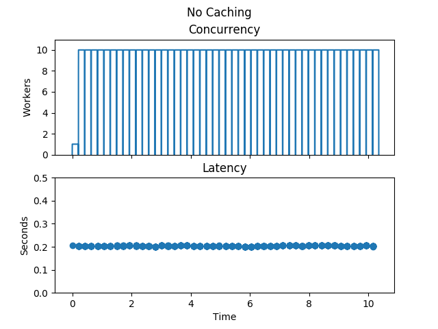
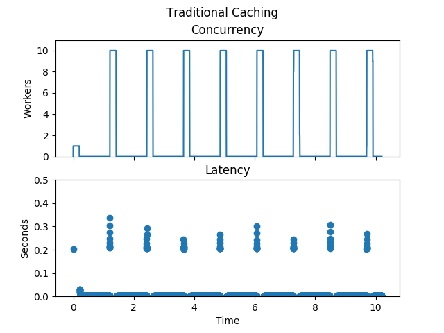
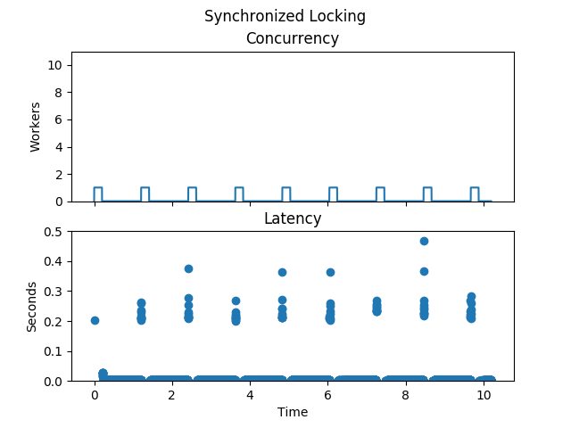
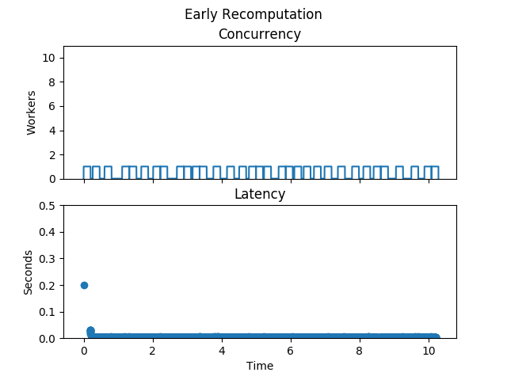
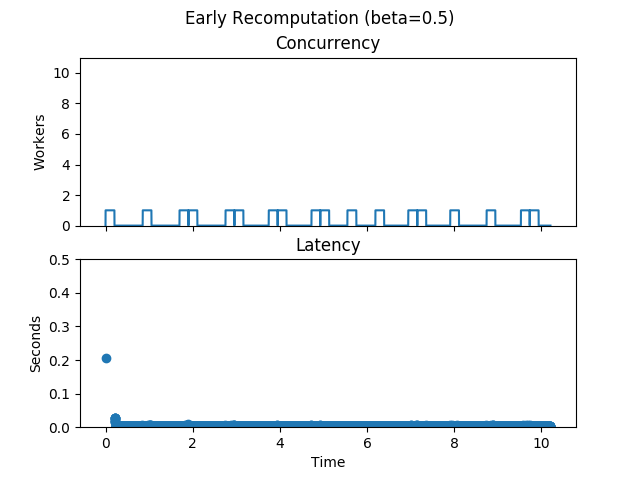

Case Study: Landing Page Caching
================================

:doc:`DiskCache <index>` version 4 added recipes for cache stampede mitigation.
Cache stampedes are a type of system overload that can occur when parallel
computing systems using memoization come under heavy load. This behaviour is
sometimes also called dog-piling, cache miss storm, cache choking, or the
thundering herd problem. Let's look at how that applies to landing page
caching.

.. code-block:: python

   import time

   def generate_landing_page():
       time.sleep(0.2)  # Work really hard.
       # Return HTML response.

Imagine a website under heavy load with a function used to generate the landing
page. There are five processes each with two threads for a total of ten
concurrent workers. The landing page is loaded constantly and takes about two
hundred milliseconds to generate.

When we look at the number of concurrent workers and the latency with no
caching at all, the graph looks as above. Notice each worker constantly
regenerates the page with a consistently slow latency.

.. code-block:: python
   :emphasize-lines: 5

   import diskcache as dc

   cache = dc.Cache()

   @cache.memoize(expire=1)
   def generate_landing_page():
       time.sleep(0.2)

Assume the result of generating the landing page can be memoized for one
second. Memoization supports a traditional caching strategy. After each second,
the cached HTML expires and all ten workers rush to regenerate the result.

There is a huge improvement in average latency now but some requests experience
worse latency than before due to the added overhead of caching. The cache
stampede is visible too as the spikes in the concurrency graph. If generating
the landing page requires significant resources then the spikes may be
prohibitive.

To reduce the number of concurrent workers, a barrier can be used to
synchronize generating the landing page.

.. code-block:: python
   :emphasize-lines: 1,2,3

   @cache.memoize(expire=0)
   @dc.barrier(cache, dc.Lock)
   @cache.memoize(expire=1)
   def generate_landing_page():
       time.sleep(0.2)

The double-checked locking uses two memoization decorators to optimistically
look up the cached result before locking. With `expire` set to zero, the
cache's get-operation is performed but the set-operation is skipped. Only the
inner-nested memoize decorator will update the cache.

The number of concurrent workers is now greatly improved. Rather than having
ten workers all attempt to generate the same result, a single worker generates
the result and the other ten benefit. The maximum latency has increased however
as three layers of caching and locking wrap the function.

Ideally, the system would anticipate the pending expiration of the cached item
and would recompute the result in a separate thread of execution. Coordinating
recomputation would be a function of the number of workers, the expiration
time, and the duration of computation. Fortunately, Vattani, et al. published
the solution in "Optimal Probabilistic Cache Stampede Prevention" in 2015.

.. code-block:: python
   :emphasize-lines: 1

   @dc.memoize_stampede(cache, expire=1)
   def generate_landing_page():
       time.sleep(0.2)

Early probabilistic recomputation uses a random number generator to simulate a
cache miss prior to expiration. The new result is then computed in a separate
thread while the cached result is returned to the caller. When the cache item
is missing, the result is computed and cached synchronously.

The latency is now its theoretical best. An initial warmup execution takes two
hundred milliseconds and the remaining calls all return immediately from the
cache. Behind the scenes, separate threads of execution are recomputing the
result of workers and updating the cache. The concurrency graph shows a nearly
constant stream of workers recomputing the function's result.

.. code-block:: python
   :emphasize-lines: 1

   @dc.memoize_stampede(cache, expire=1, beta=0.5)
   def generate_landing_page():
       time.sleep(0.2)

Vattani described an additional parameter, :math:`\beta`, which could be used
to tune the eagerness of recomputation. As the number and frequency of
concurrent worker calls increases, eagerness can be lessened by decreasing the
:math:`\beta` parameter. The default value of :math:`\beta` is one, and above
it is set to half.

Latency is now still its theoretical best while the worker load has decreased
significantly. The likelihood of simulated cache misses is now half what it was
before. The value was determined through experimentation.

.. code-block:: python
   :emphasize-lines: 1

   @dc.memoize_stampede(cache, expire=1, beta=0.3)
   def generate_landing_page():
       time.sleep(0.2)

Lets see what happens when :math:`\beta` is set too low.

.. image:: _static/early-recomputation-03.png

When set too low, the cache item expires before a new value is recomputed. The
real cache miss then causes the workers to synchronously recompute the landing
page and cache the result. With no barrier in place, eleven workers cause a
cache stampede. The eleven workers are composed of ten synchronous workers and
one in a background thread. The best way to customize :math:`\beta` is through
experimentation, otherwise the default is reasonable.

:doc:`DiskCache <index>` provides data types and recipes for memoization and
mitigation of cache stampedes. The decorators provided are composable for a
variety of scenarios. The best way to get started is with the :doc:`tutorial`.
