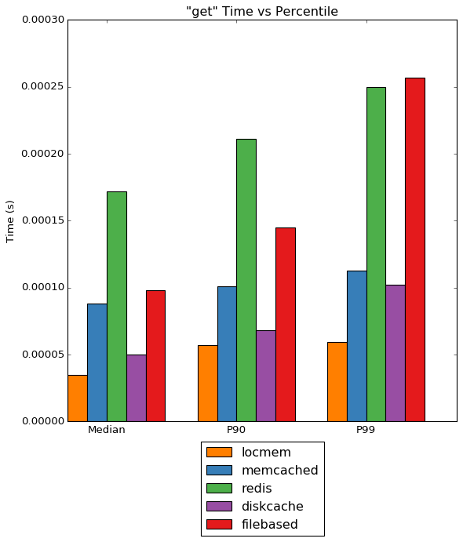
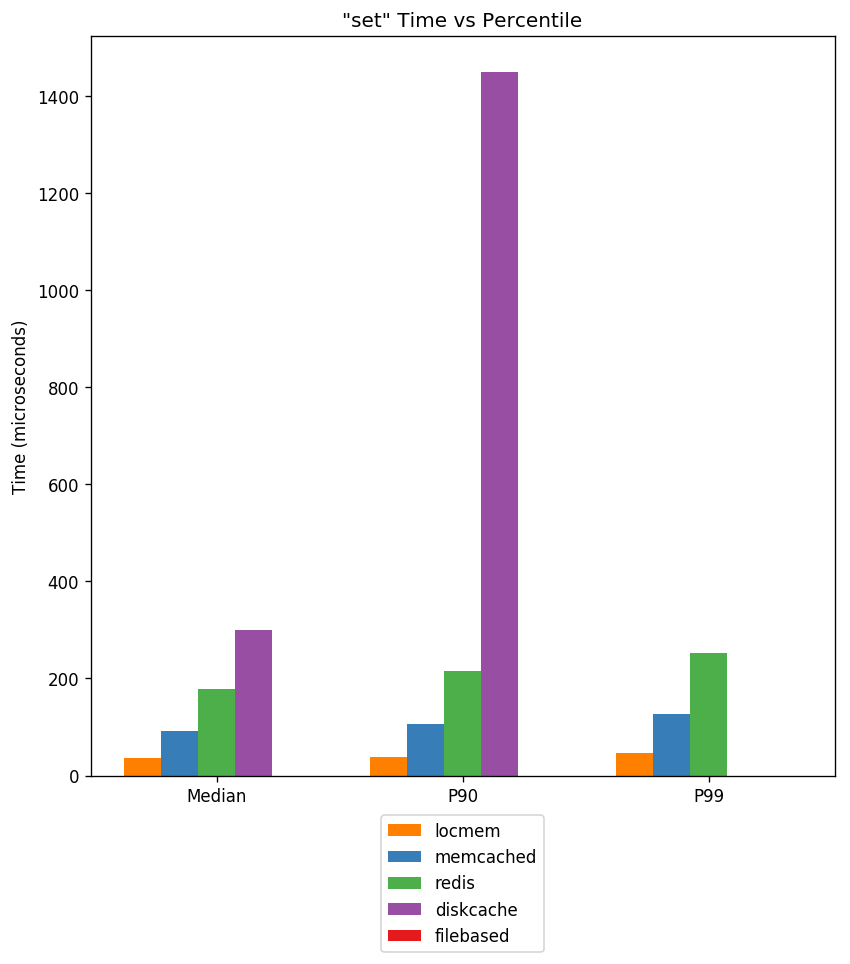
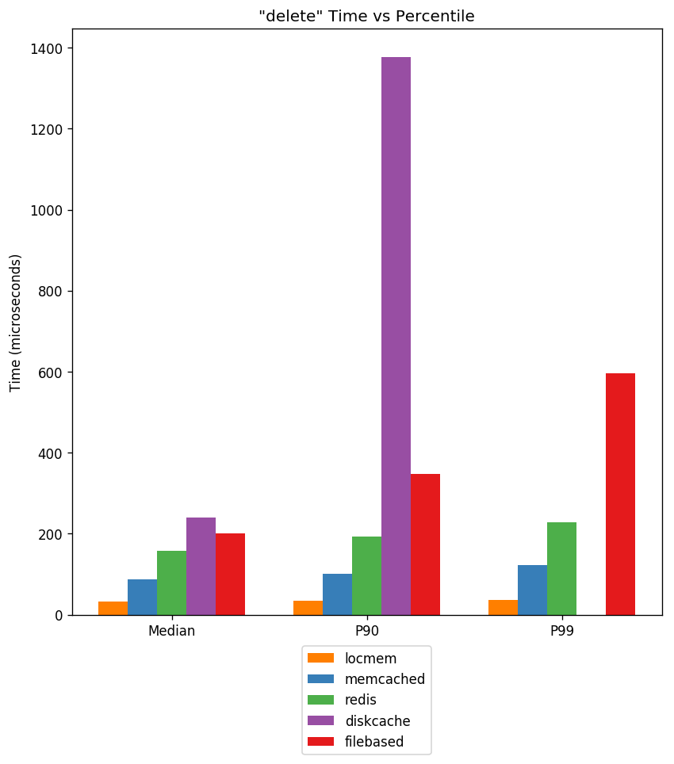

DiskCache DjangoCache Benchmarks
================================

:doc:`DiskCache <index>` provides a Django-compatible cache API in
:class:`diskcache.DjangoCache`. A discussion of its options and abilities are
described in the :doc:`tutorial <tutorial>`. Here we try to assess its
performance compared to other Django cache backends.

Keys and Values
---------------

A survey of repositories on Github showed a diversity of cached values. Among
those observed values were:

1. Processed text, most commonly HTML. The average HTML page size in 2014 was
   59KB. Javascript assets total an average of 295KB and images range
   dramatically but average 1.2MB.
2. QuerySets, the building blocks of the Django ORM.
3. Numbers, settings, and labels. Generally small values that vary in how often
   they change.

The diversity of cached values presents unique challenges. Below, keys and
values, are constrained simply to short byte strings. This is done to filter
out overhead from pickling, etc. from the benchmarks.

Backends
--------

Django ships with four cache backends: Memcached, Database, Filesystem, and
Local-memory. The Memcached backend uses the `PyLibMC`_ client backend.
Included in the results below is also Redis provided by the `django-redis`_
project built atop `redis-py`_.

Not included were four projects which were difficult to setup and so
impractical for testing.

1. | uWSGI cache backend.
   | https://pypi.python.org/pypi/django-uwsgi-cache
2. | Amazon S3 backend.
   | https://pypi.python.org/pypi/django-s3-cache
3. | MongoDB cache backend.
   | https://pypi.python.org/pypi/django-mongodb-cash-backend
4. | Cacheops - incompatible filebased caching.
   | https://pypi.python.org/pypi/django-cacheops

Other caching related projects worth mentioning:

5. | Request-specific in-memory cache.
   | http://pythonhosted.org/johnny-cache/localstore_cache.html
6. | Cacheback moves all cache store operations to background Celery tasks.
   | https://pypi.python.org/pypi/django-cacheback
7. | Newcache claims to improve Django's Memcached backend.
   | https://pypi.python.org/pypi/django-newcache
8. | Supports tagging cache entries.
   | https://pypi.python.org/pypi/cache-tagging

There are also Django packages which automatically cache database queries by
patching the ORM. `Cachalot`_ has a good comparison and discussion in its
introduction.

.. _`PyLibMC`: https://pypi.python.org/pypi/pylibmc
.. _`django-redis`: https://pypi.python.org/pypi/django-redis
.. _`redis-py`: https://pypi.python.org/pypi/redis
.. _`Cachalot`: http://django-cachalot.readthedocs.org/en/latest/introduction.html

Filebased
---------

Django's filesystem cache backend has a severe drawback. Every `set` operation
checks whether a cull operation is necessary. This check requires listing all
the files in the directory. To do so a call to ``glob.glob1`` is made. As the
directory size increases, the call slows linearly.

============ ============
Timings for glob.glob1
-------------------------
       Count         Time
============ ============
           1      1.602ms
          10      2.213ms
         100      8.946ms
        1000     65.869ms
       10000    604.972ms
      100000      6.450s
============ ============

Above, the count regards the number of files in the directory and the time is
the duration of the function call. At only a hundred files, it takes more than
five milliseconds to construct the list of files.

Concurrent Access
-----------------

The concurrent access workload starts eight worker processes each with
different and interleaved operations. None of these benchmarks saturated all
the processors. Operations used 1,100 unique keys and, where applicable, caches
were limited to 1,000 keys. This was done to illustrate the impact of the
culling strategy in ``locmem`` and ``filebased`` caches.

Get
...

Under heavy load, :class:`DjangoCache <diskcache.DjangoCache>` gets are very
low latency. At the 99th percentile they are on par with the Memcached cache
backend.

Set
...

Not displayed above is the filebased cache backend. At all percentiles, the
latency exceeded five milliseconds. Timing data is available below. Though
:doc:`DiskCache <index>` is the slowest its latency remains competitive.

Delete
......

Like sets, deletes require writes to disk. Though :class:`DjangoCache
<diskcache.DjangoCache>` is the slowest, it remains competitive with latency
less than five milliseconds. Remember that unlike Local-memory, Memached, and
Redis, it persists all cached data.

Timing Data
...........

Not all data is easily displayed in the graphs above. Miss rate, maximum
latency and total latency is recorded below.

========= ========= ========= ========= ========= ========= ========= =========
Timings for locmem
-------------------------------------------------------------------------------
   Action     Count      Miss    Median       P90       P99       Max     Total
========= ========= ========= ========= ========= ========= ========= =========
      get    712546    140750  35.048us  56.982us  59.128us  10.045ms  28.172s
      set     71530         0  36.955us  38.147us  43.154us   9.984ms   2.659s
   delete      7916         0  31.948us  34.094us  36.001us   9.987ms 267.255ms
    Total    791992                                                    31.099s
========= ========= ========= ========= ========= ========= ========= =========

Notice the high cache miss rate. This reflects the isolation of local memory
caches from each other. Also the culling strategy of local memory caches is
random.

========= ========= ========= ========= ========= ========= ========= =========
Timings for memcached
-------------------------------------------------------------------------------
   Action     Count      Miss    Median       P90       P99       Max     Total
========= ========= ========= ========= ========= ========= ========= =========
      get    712546     68969  87.976us 101.089us 113.010us 449.181us  62.615s
      set     71530         0  92.030us 105.143us 117.779us 442.982us   6.565s
   delete      7916         0  87.023us  99.897us 113.010us 206.947us 682.936ms
    Total    791992                                                    69.863s
========= ========= ========= ========= ========= ========= ========= =========

Memcached performance is low latency and very stable.

========= ========= ========= ========= ========= ========= ========= =========
Timings for redis
-------------------------------------------------------------------------------
   Action     Count      Miss    Median       P90       P99       Max     Total
========= ========= ========= ========= ========= ========= ========= =========
      get    712546     68854 171.900us 211.000us 250.101us   5.437ms 125.218s
      set     71530         0 179.052us 216.007us 255.108us   5.327ms  13.051s
   delete      7916       781 154.018us 190.020us 230.074us   1.309ms   1.253s
    Total    791992                                                   139.522s
========= ========= ========= ========= ========= ========= ========= =========

Redis performance is roughtly half that of Memcached. But notice also the
maximum latency is a magnitude larger.

========= ========= ========= ========= ========= ========= ========= =========
Timings for diskcache
-------------------------------------------------------------------------------
   Action     Count      Miss    Median       P90       P99       Max     Total
========= ========= ========= ========= ========= ========= ========= =========
      get    712546     70313  50.068us  67.949us 102.043us  14.113ms  35.382s
      set     71530         0 355.005us   1.459ms   3.817ms  31.551ms  45.698s
   delete      7916         0 240.088us   1.330ms   3.665ms  26.498ms   3.785s
    Total    791992                                                    84.865s
========= ========= ========= ========= ========= ========= ========= =========

:class:`DjangoCache <diskcache.DjangoCache>` defaults to using eight shards
with a 25 millisecond timeout. The total cache time for all operations is only
20% slower than Memcached. Cache access is in aggregate twice as fast.

========= ========= ========= ========= ========= ========= ========= =========
Timings for filebased
-------------------------------------------------------------------------------
   Action     Count      Miss    Median       P90       P99       Max     Total
========= ========= ========= ========= ========= ========= ========= =========
      get    712580    123599  97.990us 144.958us 257.015us  15.342ms  75.490s
      set     71539         0   5.274ms   6.261ms   7.501ms  26.983ms 376.789s
   delete      7873         0 139.952us 235.081us 398.874us   1.394ms   1.218s
    Total    791992                                                   453.496s
========= ========= ========= ========= ========= ========= ========= =========

Notice the higher cache miss rate. This reflects the cache's random culling
strategy.
